# HED search benchmark report

**Run:** 20260407_103440  

**Mode:** full

## Overview

This report compares the performance of the three HED string search engines provided by the `hedtools` package:

1. **basic_search** (`hed.models.basic_search.find_matching`) — regex-based pattern matching that operates directly on a `pd.Series` of raw HED strings. No schema required. Supports simple boolean AND (`@`), negation (`~`), wildcards (`*`), and parenthesised groups.
2. **QueryHandler** (`hed.models.query_handler.QueryHandler`) — full expression-tree search that operates on parsed `HedString` objects. Requires a loaded HED schema. Supports AND, OR, negation, exact groups `{}`, optional exact `{:}`, logical groups `[]`, wildcard child `?`/`??`/`???`, descendant wildcards, and quoted exact matches.
3. **StringQueryHandler** (`hed.models.string_search.StringQueryHandler`) — lightweight tree-based search that operates on raw strings via `StringNode` duck-typing. Schema is optional (via `schema_lookup` dict for ancestor queries). Provides `search_series()` convenience function for `pd.Series` input. Same query syntax as QueryHandler.

### Engine capability matrix

| Feature | basic_search | QueryHandler | StringQueryHandler |
| --- | --- | --- | --- |
| Input type | `pd.Series[str]` | `HedString` objects | Raw strings (`str`) |
| Schema required | No | Yes | Optional (via `schema_lookup`) |
| Series-native | Yes (`find_matching`) | No (manual loop) | Yes (`search_series`) |
| Boolean AND | `@word1 @word2` | `term1 and term2` | same as QH |
| Boolean OR | — | `term1 or term2` | same as QH |
| Negation | `~word` | `~term` | same as QH |
| Exact group `{}` | — | `{term1, term2}` | same as QH |
| Optional exact `{:}` | — | `{term1, term2:}` | same as QH |
| Logical group `[]` | — | `[term1, term2]` | same as QH |
| Wildcard `?/?? /???` | — | Yes | same as QH |
| Descendant wildcard | `*` suffix | `*` suffix | same as QH |
| Quoted exact match | — | `"Exact-tag"` | same as QH |
| Implementation | Regex on text | Recursive tree on parsed nodes | Recursive tree on StringNode |

## Key findings

- **Series throughput:** `basic_search` is ~5× faster than `QueryHandler` in a row-by-row loop across all tested series sizes, because it leverages vectorised pandas `str.contains` regex matching.

- **Single-string speed:** `StringQueryHandler` (no lookup) is ~42% faster than `QueryHandler` per string because it avoids schema-based `HedString` construction and uses lightweight string parsing.

- **Schema-lookup overhead:** Enabling `schema_lookup` in `StringQueryHandler` has negligible overhead for simple queries (cost comes from queries that actually use ancestor matching).

- **Nesting depth (QueryHandler):** At depth 20, search time is ~6.0× the flat-string time.

- **Nesting depth (SQH_with_lookup):** At depth 20, search time is ~6.2× the flat-string time.

- **Operation coverage:** `basic_search` supports 7 of 18 tested operations. The remaining 11 operations (OR, exact groups, logical groups, wildcards `?`/`??`/`???`, quoted terms) require `QueryHandler` or `StringQueryHandler`.

## Single-string performance

Each query was applied to a single HED string of varying complexity. Times are medians of repeated runs, in milliseconds.

|  | QueryHandler | StringQueryHandler_no_lookup | StringQueryHandler_with_lookup | basic_search |
| --- | --- | --- | --- | --- |
| large_25tag / complex_composite | 0.128 | 0.107 | 0.090 | — |
| large_25tag / exact_group | 0.093 | 0.066 | 0.066 | — |
| large_25tag / exact_group_optional | 0.109 | 0.097 | 0.098 | — |
| large_25tag / group_nesting | 0.095 | 0.067 | 0.070 | 0.121 |
| large_25tag / negation | 0.096 | 0.069 | 0.077 | 0.219 |
| large_25tag / single_bare_term | 0.132 | 0.102 | 0.093 | 0.157 |
| large_25tag / single_exact_term | 0.092 | 0.057 | 0.056 | — |
| large_25tag / single_wildcard | 0.105 | 0.064 | 0.061 | 0.119 |
| large_25tag / three_term_and | 0.096 | 0.066 | 0.066 | 0.257 |
| large_25tag / two_term_and | 0.095 | 0.066 | 0.064 | 0.190 |
| large_25tag / two_term_or | 0.104 | 0.066 | 0.084 | — |
| large_25tag / wildcard_child | 0.120 | 0.097 | 0.074 | — |
| medium_10tag / complex_composite | 0.064 | 0.050 | 0.049 | — |
| medium_10tag / exact_group | 0.055 | 0.033 | 0.028 | — |
| medium_10tag / exact_group_optional | 0.044 | 0.034 | 0.032 | — |
| medium_10tag / group_nesting | 0.039 | 0.029 | 0.038 | 0.169 |
| medium_10tag / negation | 0.034 | 0.035 | 0.024 | 0.224 |
| medium_10tag / single_bare_term | 0.041 | 0.021 | 0.021 | 0.123 |
| medium_10tag / single_exact_term | 0.032 | 0.025 | 0.022 | — |
| medium_10tag / single_wildcard | 0.031 | 0.022 | 0.021 | 0.102 |
| medium_10tag / three_term_and | 0.047 | 0.030 | 0.026 | 0.241 |
| medium_10tag / two_term_and | 0.032 | 0.023 | 0.022 | 0.365 |
| medium_10tag / two_term_or | 0.037 | 0.031 | 0.027 | — |
| medium_10tag / wildcard_child | 0.042 | 0.027 | 0.026 | — |
| small_5tag / complex_composite | 0.042 | 0.036 | 0.054 | — |
| small_5tag / exact_group | 0.024 | 0.019 | 0.019 | — |
| small_5tag / exact_group_optional | 0.028 | 0.024 | 0.034 | — |
| small_5tag / group_nesting | 0.025 | 0.019 | 0.019 | 0.128 |
| small_5tag / negation | 0.022 | 0.016 | 0.016 | 0.272 |
| small_5tag / single_bare_term | 0.020 | 0.014 | 0.013 | 0.197 |
| small_5tag / single_exact_term | 0.020 | 0.020 | 0.014 | — |
| small_5tag / single_wildcard | 0.020 | 0.014 | 0.014 | 0.108 |
| small_5tag / three_term_and | 0.022 | 0.017 | 0.017 | 0.266 |
| small_5tag / two_term_and | 0.021 | 0.016 | 0.016 | 0.191 |
| small_5tag / two_term_or | 0.024 | 0.017 | 0.018 | — |
| small_5tag / wildcard_child | 0.024 | 0.027 | 0.024 | — |
| tiny_1tag / complex_composite | 0.034 | 0.031 | 0.039 | — |
| tiny_1tag / exact_group | 0.016 | 0.018 | 0.012 | — |
| tiny_1tag / exact_group_optional | 0.022 | 0.017 | 0.017 | — |
| tiny_1tag / group_nesting | 0.027 | 0.021 | 0.014 | 0.324 |
| tiny_1tag / negation | 0.011 | 0.009 | 0.008 | 0.233 |
| tiny_1tag / single_bare_term | 0.012 | 0.007 | 0.007 | 0.131 |
| tiny_1tag / single_exact_term | 0.008 | 0.007 | 0.008 | — |
| tiny_1tag / single_wildcard | 0.014 | 0.014 | 0.012 | 0.212 |
| tiny_1tag / three_term_and | 0.013 | 0.012 | 0.011 | 0.284 |
| tiny_1tag / two_term_and | 0.010 | 0.009 | 0.009 | 0.221 |
| tiny_1tag / two_term_or | 0.011 | 0.010 | 0.011 | — |
| tiny_1tag / wildcard_child | 0.014 | 0.013 | 0.011 | — |
| xlarge_50tag / complex_composite | 0.471 | 0.243 | 0.256 | — |
| xlarge_50tag / exact_group | 0.171 | 0.121 | 0.123 | — |
| xlarge_50tag / exact_group_optional | 0.186 | 0.129 | 0.134 | — |
| xlarge_50tag / group_nesting | 0.172 | 0.122 | 0.131 | 0.141 |
| xlarge_50tag / negation | 0.228 | 0.134 | 0.119 | 0.238 |
| xlarge_50tag / single_bare_term | 0.176 | 0.113 | 0.116 | 0.131 |
| xlarge_50tag / single_exact_term | 0.184 | 0.121 | 0.114 | — |
| xlarge_50tag / single_wildcard | 0.189 | 0.119 | 0.119 | 0.127 |
| xlarge_50tag / three_term_and | 0.174 | 0.128 | 0.123 | 0.278 |
| xlarge_50tag / two_term_and | 0.169 | 0.120 | 0.130 | 0.236 |
| xlarge_50tag / two_term_or | 0.190 | 0.116 | 0.195 | — |
| xlarge_50tag / wildcard_child | 0.177 | 0.120 | 0.123 | — |
| xxlarge_100tag / complex_composite | 0.408 | 0.305 | 0.363 | — |
| xxlarge_100tag / exact_group | 0.423 | 0.229 | 0.307 | — |
| xxlarge_100tag / exact_group_optional | 0.498 | 0.243 | 0.405 | — |
| xxlarge_100tag / group_nesting | 0.574 | 0.239 | 0.434 | 0.120 |
| xxlarge_100tag / negation | 0.386 | 0.242 | 0.267 | 0.274 |
| xxlarge_100tag / single_bare_term | 0.329 | 0.248 | 0.237 | 0.154 |
| xxlarge_100tag / single_exact_term | 0.356 | 0.224 | 0.239 | — |
| xxlarge_100tag / single_wildcard | 0.380 | 0.248 | 0.277 | 0.137 |
| xxlarge_100tag / three_term_and | 0.780 | 0.251 | 0.671 | 0.289 |
| xxlarge_100tag / two_term_and | 0.580 | 0.247 | 0.456 | 0.317 |
| xxlarge_100tag / two_term_or | 0.415 | 0.269 | 0.296 | — |
| xxlarge_100tag / wildcard_child | 0.851 | 0.240 | 0.763 | — |

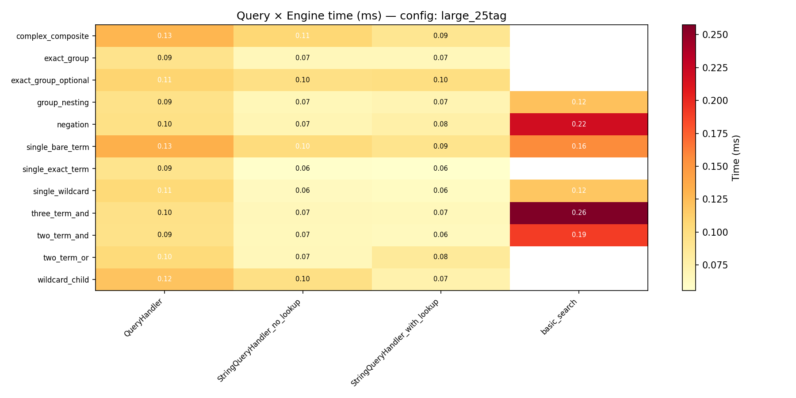

## Series performance

Whole-series search: each engine processes all rows of a `pd.Series` for a given query. `basic_search` uses vectorised regex; `search_series` uses `StringQueryHandler.search()` per row; `QueryHandler_loop` parses each row into a `HedString` then searches. Times in milliseconds.

|  | QueryHandler_loop | basic_search | search_series_no_lookup | search_series_with_lookup |
| --- | --- | --- | --- | --- |
| hetero_100 / complex_composite | 4.889 | — | 3.029 | 3.072 |
| hetero_100 / exact_group | 6.302 | — | 2.366 | 2.552 |
| hetero_100 / exact_group_optional | 4.197 | — | 3.229 | 3.280 |
| hetero_100 / group_nesting | 3.777 | 0.261 | 2.360 | 3.292 |
| hetero_100 / negation | 4.313 | 0.662 | 3.169 | 3.188 |
| hetero_100 / single_bare_term | 3.776 | 0.466 | 2.358 | 5.426 |
| hetero_100 / single_exact_term | 4.136 | — | 3.044 | 2.534 |
| hetero_100 / single_wildcard | 4.640 | 0.351 | 2.423 | 2.953 |
| hetero_100 / three_term_and | 4.624 | 0.897 | 2.415 | 2.671 |
| hetero_100 / two_term_and | 4.756 | 0.699 | 2.725 | 4.286 |
| hetero_100 / two_term_or | 4.986 | — | 4.189 | 3.073 |
| hetero_100 / wildcard_child | 4.223 | — | 3.080 | 3.070 |
| hetero_1000 / negation | 44.221 | 3.319 | 29.119 | 31.891 |
| hetero_1000 / single_bare_term | 41.281 | 2.319 | 27.981 | 28.044 |
| hetero_1000 / single_exact_term | 38.741 | — | 28.037 | 24.636 |
| hetero_1000 / single_wildcard | 43.090 | 3.789 | 25.798 | 26.164 |
| hetero_1000 / two_term_and | 45.908 | 5.579 | 27.364 | 29.513 |
| hetero_1000 / two_term_or | 47.457 | — | 27.474 | 34.288 |
| homo_10 / complex_composite | 0.342 | — | 0.332 | 0.460 |
| homo_10 / exact_group | 0.288 | — | 0.407 | 0.248 |
| homo_10 / exact_group_optional | 0.291 | — | 0.301 | 0.265 |
| homo_10 / group_nesting | 0.268 | 0.335 | 0.334 | 0.234 |
| homo_10 / negation | 0.287 | 0.772 | 0.530 | 0.520 |
| homo_10 / single_bare_term | 0.251 | 0.139 | 0.247 | 0.219 |
| homo_10 / single_exact_term | 0.271 | — | 0.315 | 0.240 |
| homo_10 / single_wildcard | 0.307 | 0.165 | 0.380 | 0.224 |
| homo_10 / three_term_and | 0.261 | 0.488 | 0.360 | 0.239 |
| homo_10 / two_term_and | 0.504 | 0.832 | 0.494 | 0.518 |
| homo_10 / two_term_or | 0.339 | — | 0.508 | 0.389 |
| homo_10 / wildcard_child | 0.273 | — | 0.302 | 0.270 |
| homo_100 / complex_composite | 5.579 | — | 3.162 | 3.420 |
| homo_100 / exact_group | 2.901 | — | 2.499 | 2.043 |
| homo_100 / exact_group_optional | 3.832 | — | 2.320 | 2.285 |
| homo_100 / group_nesting | 2.847 | 0.362 | 2.069 | 2.125 |
| homo_100 / negation | 4.339 | 1.015 | 3.731 | 2.768 |
| homo_100 / single_bare_term | 2.695 | 0.332 | 2.231 | 2.279 |
| homo_100 / single_exact_term | 2.979 | — | 2.042 | 1.888 |
| homo_100 / single_wildcard | 3.009 | 0.366 | 2.130 | 2.123 |
| homo_100 / three_term_and | 2.838 | 1.073 | 4.249 | 2.578 |
| homo_100 / two_term_and | 2.709 | 0.853 | 2.352 | 2.726 |
| homo_100 / two_term_or | 4.052 | — | 2.325 | 3.421 |
| homo_100 / wildcard_child | 4.506 | — | 2.315 | 2.290 |
| homo_1000 / negation | 34.097 | 2.612 | 26.761 | 22.398 |
| homo_1000 / single_bare_term | 29.817 | 2.177 | 21.094 | 21.542 |
| homo_1000 / single_exact_term | 34.760 | — | 26.880 | 22.927 |
| homo_1000 / single_wildcard | 33.148 | 2.031 | 21.922 | 21.505 |
| homo_1000 / two_term_and | 32.457 | 3.955 | 20.194 | 21.519 |
| homo_1000 / two_term_or | 37.171 | — | 24.401 | 24.830 |
| homo_500 / complex_composite | 19.491 | — | 15.385 | 14.446 |
| homo_500 / exact_group | 17.117 | — | 12.612 | 11.984 |
| homo_500 / exact_group_optional | 18.366 | — | 12.262 | 12.224 |
| homo_500 / group_nesting | 15.279 | 0.344 | 10.871 | 10.432 |
| homo_500 / negation | 17.831 | 1.341 | 12.766 | 13.104 |
| homo_500 / single_bare_term | 15.265 | 1.341 | 12.204 | 11.829 |
| homo_500 / single_exact_term | 16.236 | — | 11.342 | 12.019 |
| homo_500 / single_wildcard | 17.756 | 0.986 | 10.789 | 12.259 |
| homo_500 / three_term_and | 17.005 | 3.441 | 12.229 | 11.012 |
| homo_500 / two_term_and | 15.486 | 2.464 | 11.926 | 11.672 |
| homo_500 / two_term_or | 18.159 | — | 12.761 | 11.509 |
| homo_500 / wildcard_child | 17.313 | — | 11.313 | 11.745 |
| homo_5000 / negation | 184.504 | 11.371 | 119.826 | 116.848 |
| homo_5000 / single_bare_term | 157.385 | 14.259 | 102.702 | 110.445 |
| homo_5000 / single_exact_term | 177.071 | — | 114.006 | 113.971 |
| homo_5000 / single_wildcard | 176.299 | 10.710 | 115.643 | 122.830 |
| homo_5000 / two_term_and | 166.851 | 20.332 | 107.772 | 115.292 |
| homo_5000 / two_term_or | 191.891 | — | 123.276 | 128.751 |

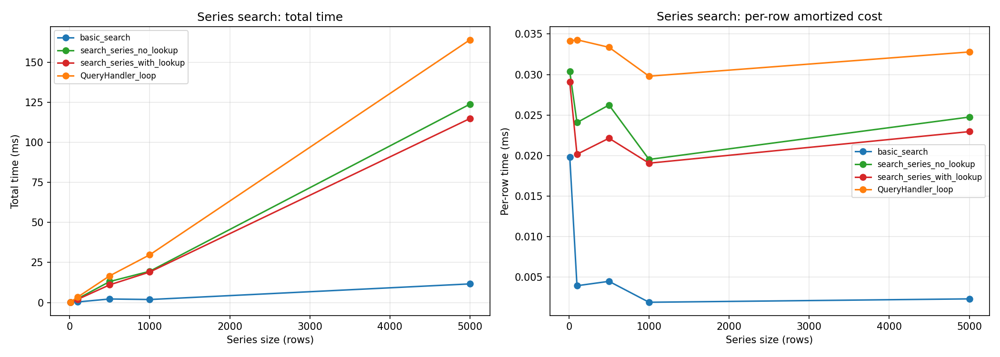

## Factor sweeps

Each sweep varies a single factor while holding others constant, measuring how performance degrades.

### Compile Vs Search

Decomposition of one-time query compilation cost vs per-string search cost. Compilation is cheap for both engines; the per-search cost dominates.

|  | QueryHandler | StringQueryHandler |
| --- | --- | --- |
| compile | 0.004 | 0.005 |
| search | 0.053 | 0.036 |

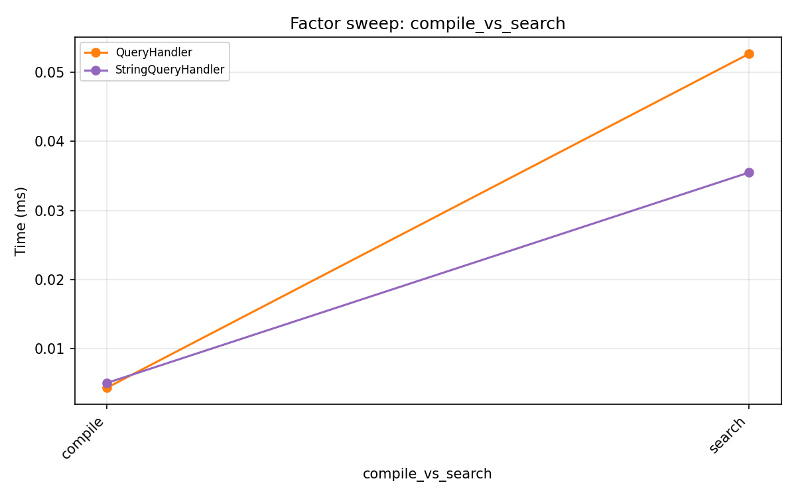

### Deep Nest Bare Term

Deep nesting sweep for *bare term* queries at depths 1–20. Shows how nesting interacts with specific query patterns.

|  | QueryHandler | SQH_no_lookup | SQH_with_lookup | basic_search |
| --- | --- | --- | --- | --- |
| 1 | 0.030 | 0.019 | 0.018 | 0.204 |
| 5 | 0.045 | 0.031 | 0.030 | 0.198 |
| 10 | 0.087 | 0.059 | 0.057 | 0.209 |
| 20 | 0.141 | 0.154 | 0.151 | 0.212 |

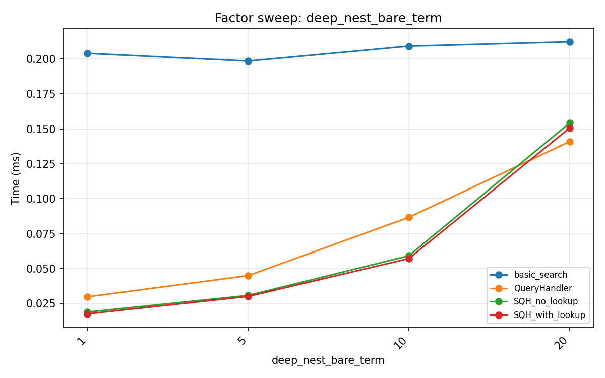

### Deep Nest Exact Group

Deep nesting sweep for *exact group* queries at depths 1–20. Shows how nesting interacts with specific query patterns.

|  | QueryHandler | SQH_no_lookup | SQH_with_lookup |
| --- | --- | --- | --- |
| 1 | 0.025 | 0.018 | 0.018 |
| 5 | 0.053 | 0.036 | 0.037 |
| 10 | 0.105 | 0.072 | 0.075 |
| 20 | 0.209 | 0.146 | 0.123 |

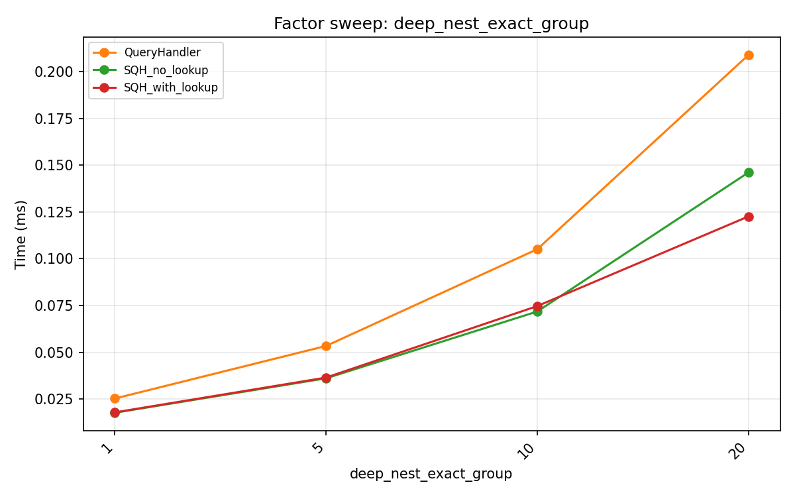

### Deep Nest Group Match

Deep nesting sweep for *group match* queries at depths 1–20. Shows how nesting interacts with specific query patterns.

|  | QueryHandler | SQH_no_lookup | SQH_with_lookup | basic_search |
| --- | --- | --- | --- | --- |
| 1 | 0.032 | 0.020 | 0.028 | 0.520 |
| 5 | 0.054 | 0.038 | 0.038 | 0.551 |
| 10 | 0.181 | 0.063 | 0.206 | 0.536 |
| 20 | 0.324 | 0.118 | 0.406 | 0.658 |

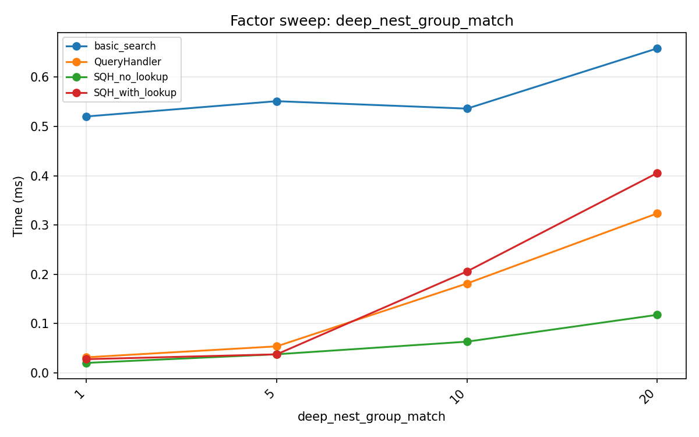

### Deep Nest Negation

Deep nesting sweep for *negation* queries at depths 1–20. Shows how nesting interacts with specific query patterns.

|  | QueryHandler | SQH_no_lookup | SQH_with_lookup | basic_search |
| --- | --- | --- | --- | --- |
| 1 | 0.021 | 0.014 | 0.014 | 0.128 |
| 5 | 0.055 | 0.037 | 0.037 | 0.163 |
| 10 | 0.101 | 0.072 | 0.067 | 0.121 |
| 20 | 0.177 | 0.129 | 0.129 | 0.112 |

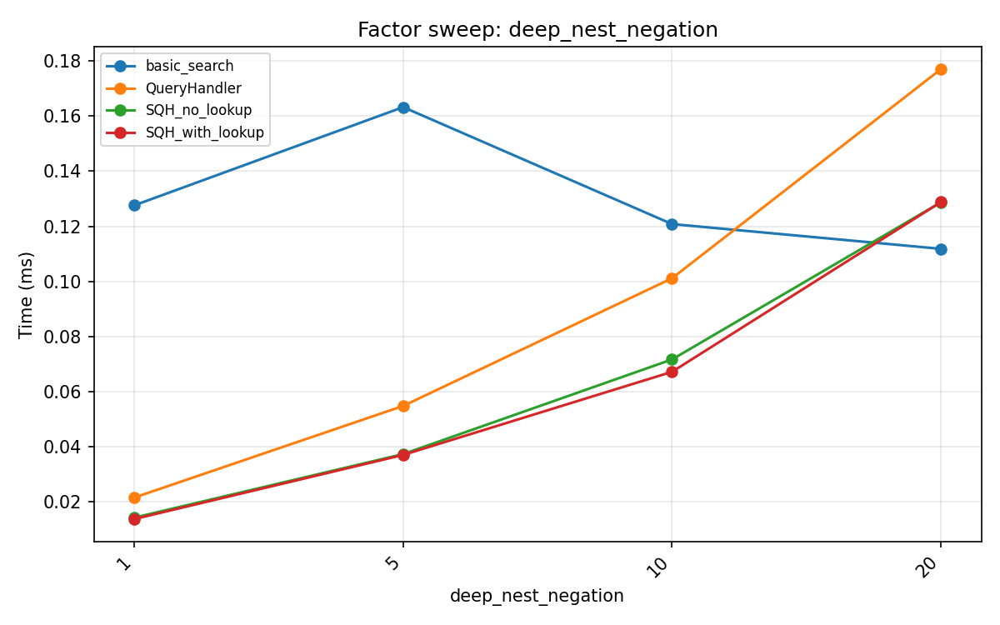

### Deep Nest Two And

Deep nesting sweep for *two and* queries at depths 1–20. Shows how nesting interacts with specific query patterns.

|  | QueryHandler | SQH_no_lookup | SQH_with_lookup | basic_search |
| --- | --- | --- | --- | --- |
| 1 | 0.043 | 0.024 | 0.032 | 0.422 |
| 5 | 0.065 | 0.052 | 0.043 | 0.395 |
| 10 | 0.205 | 0.070 | 0.181 | 0.274 |
| 20 | 0.320 | 0.109 | 0.407 | 0.355 |

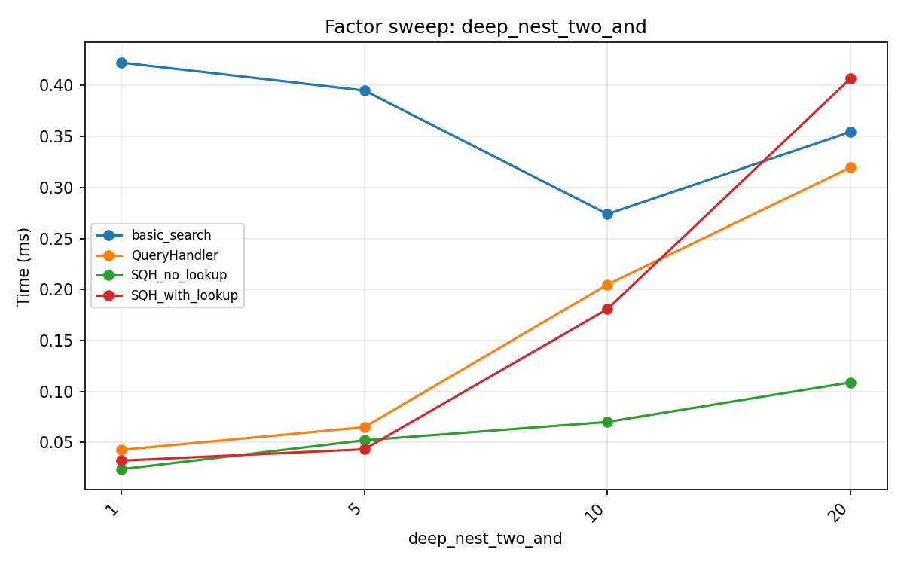

### Group Count

Number of parenthesised groups (1 to 20). More groups mean more children at the top level for tree traversal.

|  | QueryHandler | SQH_no_lookup | SQH_with_lookup | basic_search |
| --- | --- | --- | --- | --- |
| 0 | 0.032 | 0.022 | 0.020 | 0.139 |
| 1 | 0.028 | 0.019 | 0.018 | 0.129 |
| 5 | 0.045 | 0.030 | 0.029 | 0.114 |
| 10 | 0.080 | 0.053 | 0.054 | 0.135 |
| 20 | 0.140 | 0.085 | 0.086 | 0.136 |

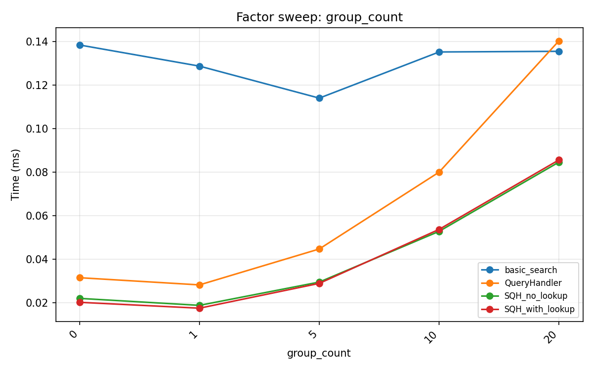

### Nesting Depth

Parenthesisation depth from 0 (flat) to 20. Deeper nesting increases the tree walk for QueryHandler/StringQueryHandler. basic_search sees variable cost because deeper nesting means more delimiter positions for its cartesian-product verification.

|  | QueryHandler | SQH_no_lookup | SQH_with_lookup | basic_search |
| --- | --- | --- | --- | --- |
| 0 | 0.026 | 0.017 | 0.018 | 0.125 |
| 1 | 0.022 | 0.013 | 0.013 | 0.256 |
| 2 | 0.028 | 0.019 | 0.018 | 0.218 |
| 3 | 0.034 | 0.023 | 0.023 | 0.215 |
| 5 | 0.058 | 0.039 | 0.039 | 0.274 |
| 10 | 0.102 | 0.058 | 0.058 | 0.256 |
| 15 | 0.124 | 0.087 | 0.085 | 0.245 |
| 20 | 0.155 | 0.108 | 0.114 | 0.234 |

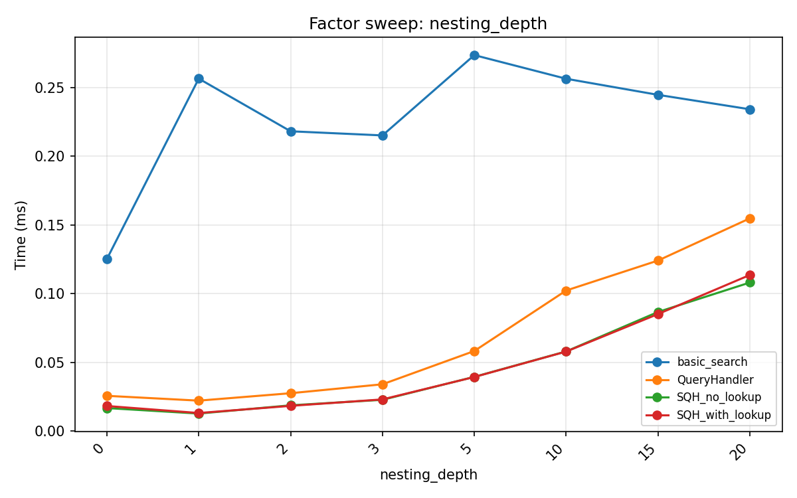

### Per Operation

Individual operation types tested in isolation. Shows which operations are expensive for each engine. basic_search shows NaN/— for unsupported operations.

|  | QueryHandler | SQH_no_lookup | SQH_with_lookup | basic_search |
| --- | --- | --- | --- | --- |
| and_2 | 0.063 | 0.041 | 0.042 | 0.321 |
| and_3 | 0.067 | 0.045 | 0.056 | 0.355 |
| bare_term | 0.061 | 0.037 | 0.037 | 0.278 |
| complex_onset_def | 0.113 | 0.068 | 0.046 | — |
| deep_and_chain | 0.117 | 0.059 | 0.096 | 0.515 |
| descendant_nested | 0.138 | 0.086 | 0.045 | — |
| double_negation | 0.057 | 0.035 | 0.034 | — |
| exact_group_{} | 0.052 | 0.030 | 0.045 | — |
| exact_optional_{:} | 0.071 | 0.043 | 0.049 | — |
| exact_quoted | 0.062 | 0.030 | 0.028 | — |
| negation | 0.083 | 0.043 | 0.043 | 0.160 |
| nested_group_[] | 0.057 | 0.039 | 0.041 | 0.634 |
| nested_or_and | 0.080 | 0.057 | 0.058 | — |
| or | 0.058 | 0.037 | 0.038 | — |
| wildcard_? | 0.086 | 0.047 | 0.067 | — |
| wildcard_?? | 0.068 | 0.041 | 0.048 | — |
| wildcard_??? | 0.074 | 0.041 | 0.124 | — |
| wildcard_prefix | 0.046 | 0.037 | 0.044 | 0.204 |

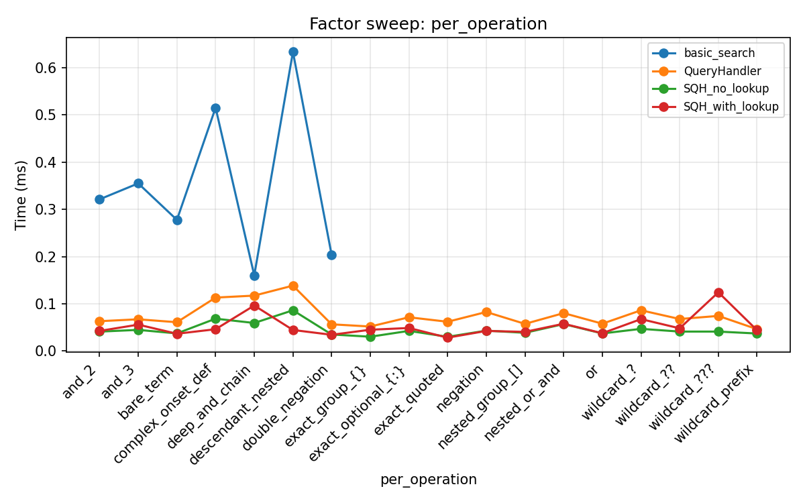

### Query Complexity

Query expression complexity from a bare term to a multi-clause composite. More clauses = more expression-tree nodes to evaluate per candidate.

|  | QueryHandler | SQH_no_lookup | SQH_with_lookup | basic_search |
| --- | --- | --- | --- | --- |
| 1_single_term | 0.134 | 0.100 | 0.074 | 0.247 |
| 2_two_and | 0.152 | 0.093 | 0.090 | 0.405 |
| 3_three_and | 0.158 | 0.103 | 0.078 | 0.460 |
| 4_or | 0.134 | 0.071 | 0.081 | — |
| 5_negation | 0.088 | 0.056 | 0.059 | 0.286 |
| 6_group | 0.138 | 0.094 | 0.091 | 0.361 |
| 7_exact | 0.120 | 0.078 | 0.069 | — |
| 8_complex | 0.106 | 0.078 | 0.067 | — |

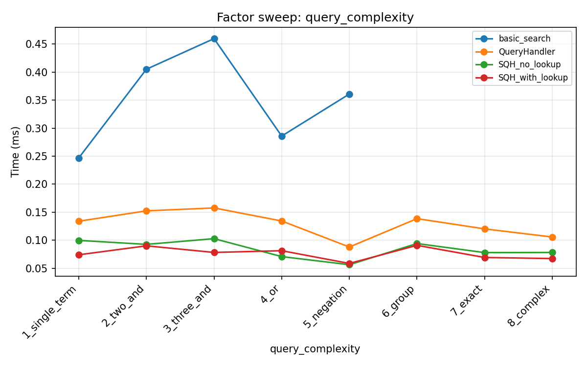

### Repeated Tags

Repetitions of a target tag (0 to 40). basic_search's `verify_search_delimiters` uses `itertools.product` over delimiter positions; repeated tags multiply the search space. Tree-based engines are unaffected.

|  | QueryHandler | SQH_no_lookup | SQH_with_lookup | basic_search |
| --- | --- | --- | --- | --- |
| 0 | 0.034 | 0.022 | 0.021 | 0.544 |
| 3 | 0.070 | 0.039 | 0.051 | 0.720 |
| 5 | 0.151 | 0.084 | 0.115 | 0.791 |
| 10 | 0.093 | 0.073 | 0.071 | 0.940 |
| 20 | 0.182 | 0.138 | 0.137 | 0.668 |
| 40 | 0.200 | 0.195 | 0.198 | 0.654 |

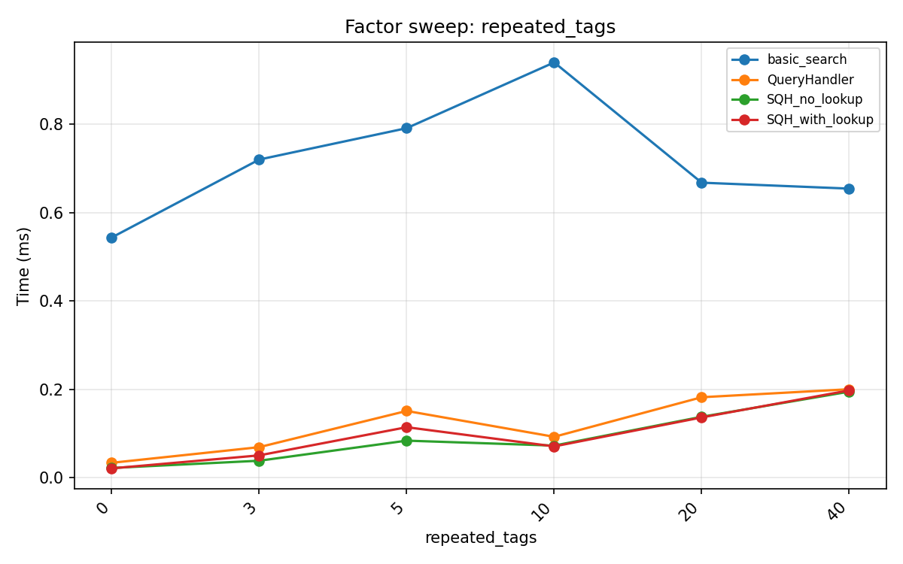

### Schema Lookup

StringQueryHandler with vs without the `schema_lookup` dictionary. The lookup enables ancestor-based matching (e.g. `Event` matches `Sensory-event`) at a cost.

|  | StringQueryHandler |
| --- | --- |
| no_lookup | 0.030 |
| with_lookup | 0.029 |

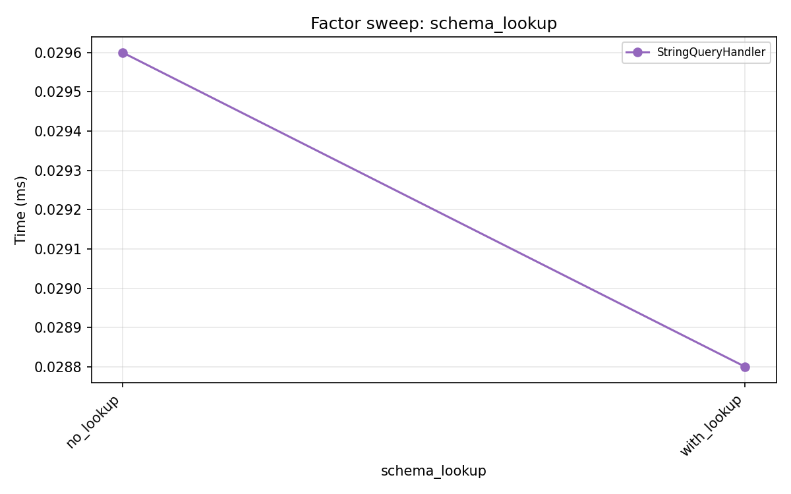

### Series Size

Number of rows in the Series (10 to 5000). basic_search scales sub-linearly thanks to vectorised pandas regex. All other engines scale linearly (per-row cost is fixed).

|  | QueryHandler_loop | basic_search | search_series_no_lookup | search_series_with_lookup |
| --- | --- | --- | --- | --- |
| 10 | 0.341 | 0.198 | 0.304 | 0.291 |
| 100 | 3.429 | 0.395 | 2.408 | 2.017 |
| 500 | 16.681 | 2.247 | 13.121 | 11.073 |
| 1000 | 29.799 | 1.912 | 19.530 | 19.069 |
| 5000 | 163.936 | 11.653 | 123.791 | 114.813 |

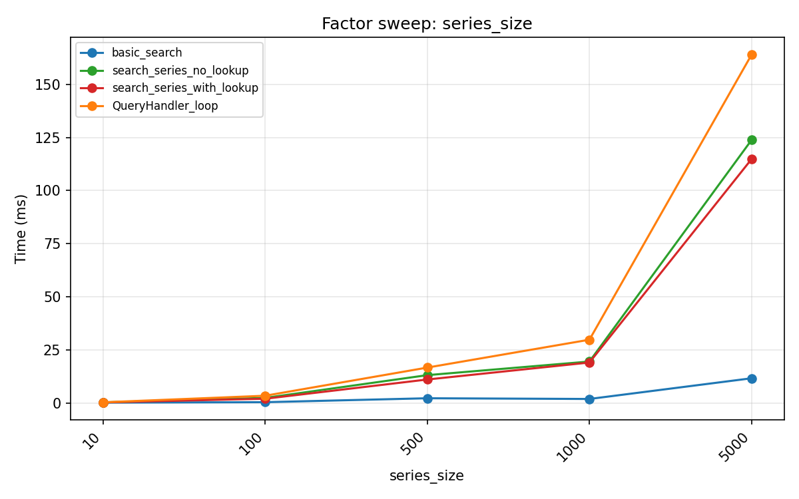

### String Form

Short-form vs long-form HED strings. Long-form strings have fully expanded paths (e.g. `Event/Sensory-event`) and are longer, increasing regex and parse cost.

|  | QueryHandler | SQH_no_lookup | SQH_with_lookup | basic_search |
| --- | --- | --- | --- | --- |
| long | 0.074 | 0.063 | 0.059 | 0.121 |
| short | 0.044 | 0.029 | 0.029 | 0.124 |

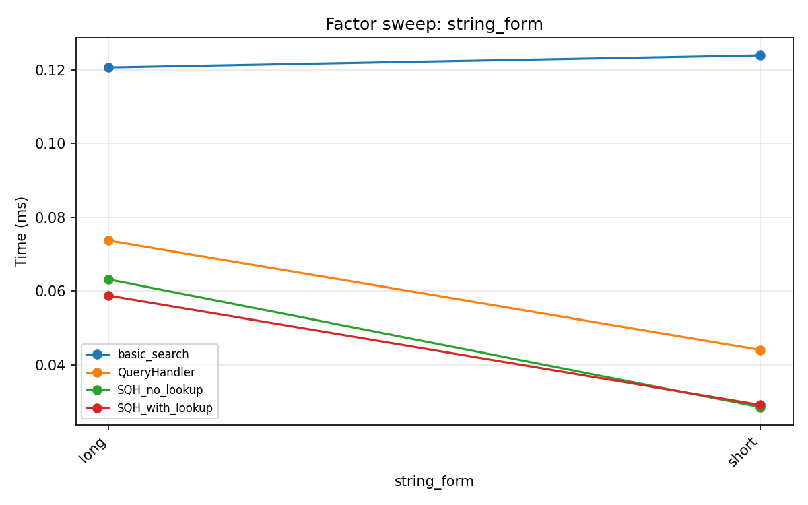

### Tag Count

Number of tags in the HED string (1 to 100). basic_search time is dominated by regex compilation overhead and stays roughly constant; tree-based engines scale linearly with the number of nodes to traverse.

|  | QueryHandler | SQH_no_lookup | SQH_with_lookup | basic_search |
| --- | --- | --- | --- | --- |
| 1 | 0.014 | 0.004 | 0.009 | 0.294 |
| 5 | 0.019 | 0.013 | 0.013 | 0.163 |
| 10 | 0.031 | 0.018 | 0.017 | 0.150 |
| 25 | 0.061 | 0.080 | 0.086 | 0.124 |
| 50 | 0.149 | 0.160 | 0.183 | 0.184 |
| 100 | 0.287 | 0.167 | 0.164 | 0.271 |

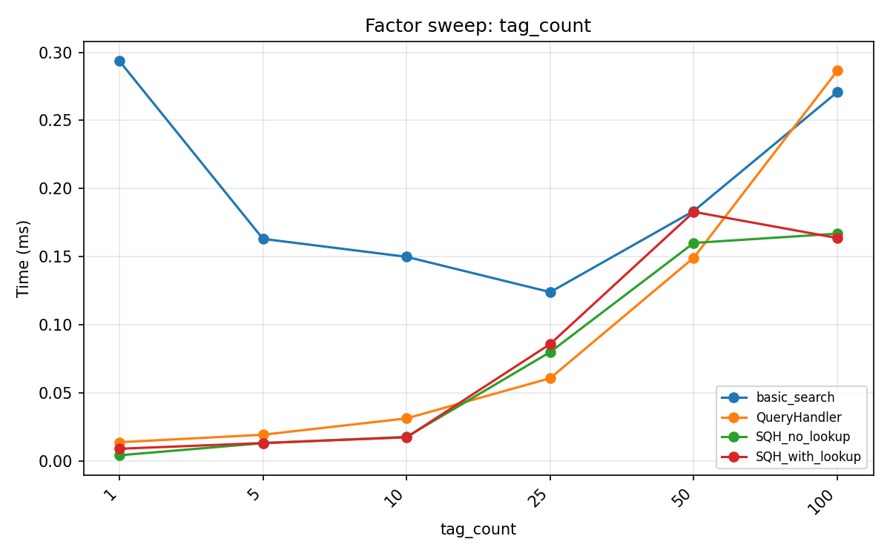

## Real BIDS data

Search over 200 rows of real BIDS event data (`eeg_ds003645s_hed` test dataset, HED_column values). Times in milliseconds.

|  | QueryHandler_loop | basic_search | search_series |
| --- | --- | --- | --- |
| complex_composite | 14.162 | — | 9.525 |
| exact_group | 9.327 | — | 6.595 |
| exact_group_optional | 11.674 | — | 5.826 |
| group_nesting | 7.855 | 0.291 | 7.821 |
| negation | 8.035 | 0.880 | 6.794 |
| single_bare_term | 9.011 | 2.472 | 6.509 |
| single_exact_term | 8.097 | — | 5.542 |
| single_wildcard | 8.157 | 0.629 | 4.884 |
| three_term_and | 8.497 | 1.907 | 5.061 |
| two_term_and | 8.838 | 1.199 | 4.939 |
| two_term_or | 7.914 | — | 6.774 |
| wildcard_child | 12.590 | — | 8.899 |

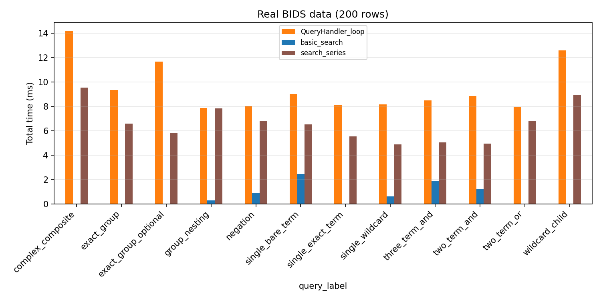

## Recommendations

**Choose `basic_search` when:** You need the fastest possible series-level search, your queries use only simple terms, AND, negation, or descendant wildcards (`*`), and you don't need schema-aware matching. Ideal for filtering event files where speed matters and queries are simple.

**Choose `StringQueryHandler` when:** You need the full query language (OR, exact groups, logical groups, wildcards) but want to avoid the overhead of parsing every HED string through the schema. `search_series()` is the best general-purpose option when operating on raw strings from tabular files.

**Choose `QueryHandler` when:** You already have parsed `HedString` objects (e.g. from validation pipelines), or you need exact schema-validated matching. The additional overhead comes from `HedString` construction, not the search itself.

## Methodology

- **Timing:** `timeit` with 20 iterations (single-string), 5 iterations (series), 10 iterations (sweeps). Median of all iterations reported.
- **Schema:** HED 8.4.0 loaded once and reused across all benchmarks.
- **Data generation:** Synthetic strings built from real schema tags with controlled tag count, nesting depth, group count, and tag repetition.
- **schema_lookup:** Generated via `generate_schema_lookup(schema)` — a dict mapping each short tag to its ancestor tuple.
- **Environment:** Results depend on hardware; relative ratios between engines are the meaningful comparison.
