---
myst:
  html_meta:
    description: HED search details — implementation comparison and performance benchmarks for basic_search, QueryHandler, and StringQueryHandler in hedtools
    keywords: HED search, string search, query handler, basic search, performance, benchmarks, hedtools, pattern matching
---

```{index} search, string search, query, QueryHandler, StringQueryHandler, basic_search
```

# HED search details

HEDtools provides three distinct mechanisms for searching HED-annotated data. This page covers their design and query languages ({ref}`implementations <hed-search-implementations>`) and measured performance characteristics ({ref}`performance <hed-search-performance>`).

(hed-search-implementations)=

## HED search implementations

The three implementations share a common goal — "does this HED string match this query?" — but differ substantially in their inputs, capabilities, schema requirements, and performance characteristics. Choosing the right implementation depends on whether you need schema-aware ancestor matching, full group-structural queries, or raw throughput on unannotated strings.

### Overview of the three implementations

#### `basic_search` — regex-based flat matching

Located in {mod}`hed.models.basic_search`, the `find_matching()` function operates directly on a `pd.Series` of raw HED strings using compiled regular expressions. It requires no schema and no parsing step, making it the fastest option for bulk row filtering.

Key characteristics:

- Input is a `pd.Series` of raw strings; output is a `pd.Series[bool]` mask.
- The query is compiled once into a regex and applied with `Series.str.contains`.
- Matches are purely literal — `Event` does not match `Sensory-event`.
- `@A` in a basic-search query means A **must be present** anywhere in the string (note: this is the **opposite** of what `@A` means in `QueryHandler`/`StringQueryHandler`).
- `~A` means A must not appear anywhere (global negation).
- `(A, B)` syntax checks that A and B appear at the same nesting level.
- Wildcard `A*` expands to the regex `A.*?`, which can span `/` and match mid-token substrings.

Use `basic_search` when you are working with a large collection of raw strings as a `pd.Series`, don't need ancestor matching, and want maximum throughput. See {func}`hed.models.basic_search.find_matching`.

#### `QueryHandler` — schema-backed object search

Located in {mod}`hed.models.query_handler`, `QueryHandler` is the full-featured search engine. It compiles a query string into an expression tree once, then evaluates that tree against `HedString` objects that have already been parsed against a loaded `HedSchema`.

Key characteristics:

- Input is a `HedString` object; a full `HedSchema` is required.
- Output is a `list[SearchResult]` containing `HedTag` / `HedGroup` object references, useful for tag-level introspection (not just row filtering).
- Supports the complete query language: `&&`, `||`, `~`, `@`, `{}`, `[]`, `{:}`, `?`, `??`, `???`.
- `@A` means A must **not** appear anywhere in the string.
- Ancestor matching is exact — the schema normalises both query and string tags to short form, so `Event` matches `Sensory-event` because the schema knows `Sensory-event` descends from `Event`.
- Per-string cost includes a full HedString parse and schema tag resolution.

Use `QueryHandler` when you need schema-aware ancestor matching, or when you want object references (e.g., to retrieve the matched group for further processing). See {class}`hed.models.query_handler.QueryHandler`.

#### `StringQueryHandler` — tree-based schema-optional search

Located in {mod}`hed.models.string_search`, `StringQueryHandler` is a new middle-ground implementation that inherits from `QueryHandler` and reuses the full expression-tree compiler, but operates on raw strings rather than pre-parsed `HedString` objects.

It parses each raw HED string into a lightweight {class}`~hed.models.string_search.StringNode` tree that duck-types the `HedGroup`/`HedTag` interfaces expected by the existing expression evaluators — so all `QueryHandler` query syntax works unchanged.

Key characteristics:

- Input is a raw string (or a plain `list[str]` via {func}`~hed.models.string_search.string_search`).
- Schema is **optional**: pass a `schema_lookup` dict (see {mod}`hed.models.schema_lookup`) to enable ancestor matching for short-form strings (e.g. `Event` matching `Sensory-event`); omit it for purely literal matching.
- Output is a list (truthy/falsy) — row-filtering only, no object references.
- Supports the same full query syntax as `QueryHandler` (`&&`, `||`, `~`, `@`, `{}`, etc.).
- `@A` carries the same semantics as `QueryHandler` — A must **not** be present.
- Long-form strings (`Event/Sensory-event`) support ancestor matching via slash-splitting even without a lookup. Short-form strings (`Sensory-event`) require a `schema_lookup` for ancestor matching; without one, matching is purely literal.
- Parse cost is a lightweight recursive split — much cheaper than a full HedString + schema parse.

Use `StringQueryHandler` when you have raw strings (not `HedString` objects), need the full `QueryHandler` query syntax, and either don't have a schema available or want faster processing at the cost of losing full schema-aware ancestor matching. See {class}`hed.models.string_search.StringQueryHandler`.

#### Generating a schema lookup

If you want `StringQueryHandler` to resolve ancestors for short-form strings (e.g. query `Event` matching `Sensory-event`) without a full schema parse per row, you can pre-generate a lookup dictionary from a `HedSchema`:

```python
from hed import load_schema_version
from hed import generate_schema_lookup, save_schema_lookup, load_schema_lookup

schema = load_schema_version("8.4.0")
lookup = generate_schema_lookup(schema)  # {short_name_casefold: tag_terms_tuple}

# Persist for reuse
save_schema_lookup(lookup, "hed840_lookup.json")
lookup = load_schema_lookup("hed840_lookup.json")
```

See {func}`hed.models.schema_lookup.generate_schema_lookup`.

______________________________________________________________________

### Comparison tables

#### Core characteristics

| Property              | `basic_search`                 | `QueryHandler`                                     | `StringQueryHandler`                            |
| --------------------- | ------------------------------ | -------------------------------------------------- | ----------------------------------------------- |
| **Input**             | `pd.Series` of raw strings     | `HedString` object                                 | Raw string or `list[str]` (via `string_search`) |
| **Schema required**   | No                             | Yes — full `HedSchema` for tag parsing             | No; optional `schema_lookup` dict               |
| **Output**            | `pd.Series[bool]` mask         | `list[SearchResult]` with `HedTag`/`HedGroup` refs | `list[bool]`; no object references              |
| **Result usable for** | Row filtering                  | Row filtering + tag/group introspection            | Row filtering only                              |
| **Batch API**         | `find_matching(series, query)` | Manual loop                                        | `string_search(strings, query)`                 |
| **Parse cost**        | Regex compilation once         | Full `HedString` + schema parse per string         | Lightweight tree parse per string               |
| **Unrecognised tags** | Matched literally              | Silent match failure (`tag_terms = ()`)            | Matched literally                               |

#### Query syntax

| Feature                      | `basic_search` query syntax                         | `QueryHandler` / `StringQueryHandler` query syntax |
| ---------------------------- | --------------------------------------------------- | -------------------------------------------------- |
| **AND**                      | Space or comma between terms (context-dependent)    | `A && B` or `A, B`                                 |
| **OR**                       | Not supported                                       | `A \|\| B`                                         |
| **Absent from string (`@`)** | ⚠️ `@A` means A **must be present** anywhere        | `@A` means A must **not** appear anywhere          |
| **Must-not-appear (`~`)**    | `~A` — A must not appear anywhere (global)          | `~A` — negation within group context (local)       |
| **Prefix wildcard**          | `A*` → regex `A.*?` (spans `/`, matches substrings) | `A*` → prefix on short form only                   |
| **Full regex per term**      | Yes (`regex=True` mode)                             | No                                                 |
| **Quoted exact match**       | No                                                  | `"A"` — exact match, no ancestor search            |
| **Implicit default**         | If no `(` or `@`: all terms become "anywhere"       | No implicit conversion — must be explicit          |

#### Group / structural operators

| Feature                           | `basic_search`                            | `QueryHandler`                               | `StringQueryHandler`   |
| --------------------------------- | ----------------------------------------- | -------------------------------------------- | ---------------------- |
| **Same nesting level**            | `(A, B)` — A and B at same relative level | N/A — use `{A, B}`                           | N/A — use `{A, B}`     |
| **Same parenthesised group `{}`** | No                                        | `{A, B}` — must share a direct parent group  | Same as `QueryHandler` |
| **Exact group `{:}`**             | No                                        | `{A, B:}` — same group, no other children    | Same                   |
| **Optional exact group**          | No                                        | `{A, B: C}` — A and B required, C optional   | Same                   |
| **Descendant group `[]`**         | No                                        | `[A, B]` — both in same subtree at any depth | Same                   |
| **Any child `?`**                 | No                                        | `?` — any tag or group child                 | Same                   |
| **Any tag child `??`**            | No                                        | `??` — any leaf (non-group) child            | Same                   |
| **Any group child `???`**         | No                                        | `???` — any parenthesised group child        | Same                   |
| **Nested query operators**        | No                                        | Yes — full recursive composition             | Same                   |

#### Ancestor / cross-form search

| Scenario                                                | `basic_search`                                  | `QueryHandler`                          | `StringQueryHandler`                                             |
| ------------------------------------------------------- | ----------------------------------------------- | --------------------------------------- | ---------------------------------------------------------------- |
| Query `Event`, string `Sensory-event` (short form)      | ❌ literal only                                 | ✅ `tag_terms` from schema              | ✅ with `schema_lookup`; ❌ without                              |
| Query `Event`, string `Event/Sensory-event` (long form) | ❌ `Event` ≠ `Event/Sensory-event`              | ✅ schema normalises                    | ✅ slash-split produces `tag_terms = ("event", "sensory-event")` |
| Query `Event/Sensory-event`, string `Sensory-event`     | ❌                                              | ✅ schema normalises both to short form | ❌ no schema to normalise                                        |
| Schema-free ancestor search                             | `convert_query()` + long-form list (workaround) | N/A — schema always required            | ✅ works natively for long-form strings                          |
| Tag `Def/Name` matched by query `Def`                   | ❌ literal prefix mismatch                      | ✅ `short_base_tag = "Def"`             | ✅ `tag_terms` contains `"def"`                                  |

#### Critical semantic traps

These differences are silent — no error, just wrong answers if you mix up query strings across implementations:

| Operator          | `basic_search`                                           | `QueryHandler` / `StringQueryHandler`                                               |
| ----------------- | -------------------------------------------------------- | ----------------------------------------------------------------------------------- |
| `@A`              | A **must** appear anywhere in the string                 | A must **not** appear anywhere in the string                                        |
| `~A`              | A must not appear **anywhere** (global)                  | A must not appear in any group that also matches the rest of the expression (local) |
| `*` wildcard      | Regex `.*?` — spans `/` and matches mid-token substrings | Strict prefix on the tag's short form — anchored to start                           |
| No-operator `A B` | Both present anywhere (implicit `@@`)                    | Parse error — `&&` required                                                         |

______________________________________________________________________

(hed-search-performance)=

## HED search performance

Benchmarks were run using HED 8.4.0 with `timeit` on both synthetic strings and real BIDS event data. All times are medians in milliseconds. Relative ratios between engines are more meaningful than absolute values, which depend on hardware.

### Benchmark query suite

All 18 operations below are used across the benchmarks. The **single-string** and **list** benchmarks use the 12-query core set (rows marked ✓); the **per-operation sweep** uses all 18 on a fixed structured string; **nesting-depth sweeps** use the 5-query subset marked †.

| Category         | Label                  | Object search / String search query                   | Basic search query                     | Core | Depth |
| ---------------- | ---------------------- | ----------------------------------------------------- | -------------------------------------- | :--: | :---: |
| Simple           | `bare_term`            | `Event`                                               | `@Event`                               |  ✓   |   †   |
| Simple           | `exact_quoted`         | `"Event"` (exact quoted match)                        | — unsupported                          |  ✓   |       |
| Simple           | `wildcard_prefix`      | `Def/*`                                               | `Def/*`                                |  ✓   |       |
| Boolean          | `and_2`                | `Event && Action`                                     | `@Event, @Action`                      |  ✓   |   †   |
| Boolean          | `and_3`                | `Event && Action && Agent`                            | `@Event, @Action, @Agent`              |  ✓   |       |
| Boolean          | `deep_and_chain`       | `Event && Action && Agent && Item && Red`             | `@Event, @Action, @Agent, @Item, @Red` |      |       |
| Boolean          | `or`                   | `Event \|\| Action`                                   | — unsupported                          |  ✓   |       |
| Boolean          | `negation`             | `~Event`                                              | `~Event`                               |  ✓   |   †   |
| Boolean          | `double_negation`      | `~(~Event)`                                           | — unsupported                          |      |       |
| Boolean          | `nested_or_and`        | `(Event \|\| Sensory-event) && (Action \|\| Agent)`   | — unsupported                          |      |       |
| Group structural | `group_nesting`        | `[Event && Action]`                                   | `(Event, Action)`                      |  ✓   |   †   |
| Group structural | `exact_group`          | `{Event && Action}`                                   | — unsupported                          |  ✓   |   †   |
| Group structural | `exact_group_optional` | `{Event && Action: Agent}`                            | — unsupported                          |  ✓   |       |
| Group structural | `wildcard_?`           | `{Event, ?}`                                          | — unsupported                          |  ✓   |       |
| Group structural | `wildcard_??`          | `{Event, ??}`                                         | — unsupported                          |      |       |
| Group structural | `wildcard_???`         | `{Event, ???}`                                        | — unsupported                          |      |       |
| Complex          | `descendant_nested`    | `[Def && Onset]`                                      | — unsupported                          |      |       |
| Complex          | `complex_composite`    | `{(Onset \|\| Offset), (Def \|\| {Def-expand}): ???}` | — unsupported                          |  ✓   |       |

### Key findings

- **Batch throughput:** basic search is ~16× faster than an object search row-by-row loop at 5 000 rows because it leverages vectorized pandas `str.contains`; string search (plain list) is ~1.5× faster than object search.
- **Single-string speed:** string search (no lookup) is ~39% faster than object search per string because it avoids schema-based `HedString` construction.
- **Schema-lookup overhead:** enabling `schema_lookup` in string search has negligible overhead for most queries; cost appears only when ancestor matching is actually invoked.
- **Nesting depth:** at depth 20, object search is ~8× slower than on a flat string; string search shows similar scaling (~8×).
- **Operation coverage:** basic search supports 7 of 18 tested operation types. The remaining 11 (OR, exact groups, logical groups, `?`/`??`/`???` wildcards, quoted terms) require object search or string search.

(row-by-row-search-scaling)=

### Row-by-row search scaling

Search over a list of HED strings of increasing length. Basic search uses vectorized pandas regex on a `pd.Series`. String search calls `.search()` per element on a plain list; object search constructs a `HedString` per row then searches. Query: `bare_term` (`Event` / `@Event`).

|  Rows | Object search (ms) | Basic search (ms) | String search (ms) |
| ----: | -----------------: | ----------------: | -----------------: |
|    10 |               0.29 |              0.29 |               0.26 |
|   100 |               3.62 |              0.57 |               3.33 |
|   500 |               15.6 |              1.42 |               12.2 |
| 1 000 |               31.7 |              1.22 |               22.8 |
| 5 000 |                180 |              11.3 |                118 |

Basic search scales sub-linearly because vectorized regex amortises overhead across rows. String search and object search scale linearly (fixed per-row cost). Basic search is ~16× faster than object search at 5 000 rows; string search is roughly 1.5× faster than object search.

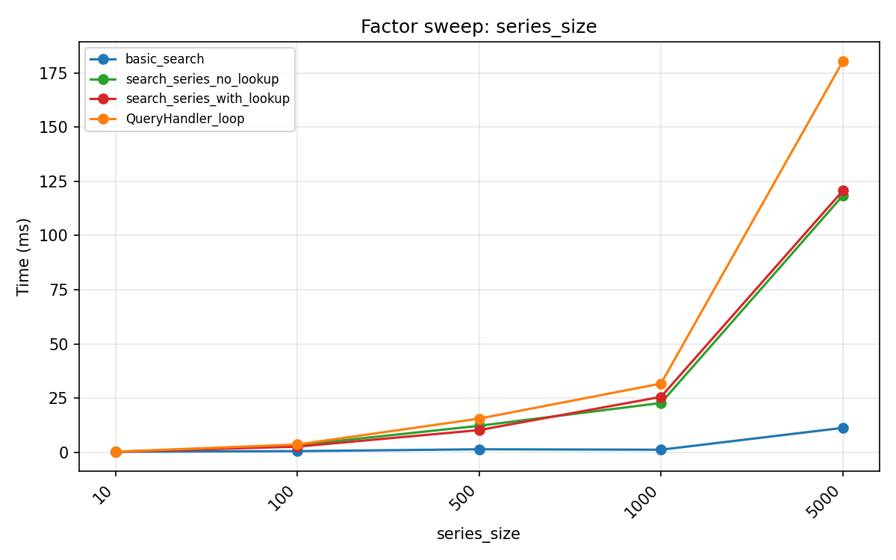

### Single-string timing

Per-string median search time (ms) across string sizes. Tag counts: tiny = 1, small = 5, medium = 10, large = 25, xlarge = 50, xxlarge = 100. Larger strings also contain nested groups (e.g. large = 5 groups at depth 2). The table below is filtered to the `bare_term` query (`Event` / `@Event`) to isolate parse and tree-walk cost from query complexity; see the query heatmap image below for all 12 queries.

(Example 10-tag string: `Human-agent, Move, Computed-feature, Age, Aroused, 3D-shape, Little-toe, To-right-of, Brain-region, DarkSeaGreen`)

| String size        | Object search (ms) | String search (ms) | Basic search (ms) |
| ------------------ | -----------------: | -----------------: | ----------------: |
| tiny (1 tag)       |              0.012 |              0.007 |             0.131 |
| small (5 tags)     |              0.020 |              0.014 |             0.197 |
| medium (10 tags)   |              0.041 |              0.021 |             0.123 |
| large (25 tags)    |              0.132 |              0.102 |             0.157 |
| xlarge (50 tags)   |              0.176 |              0.113 |             0.131 |
| xxlarge (100 tags) |              0.329 |              0.248 |             0.154 |

Basic search regex overhead dominates on small strings; object search and string search dominate on large strings. The crossover occurs around 25–50 tags.

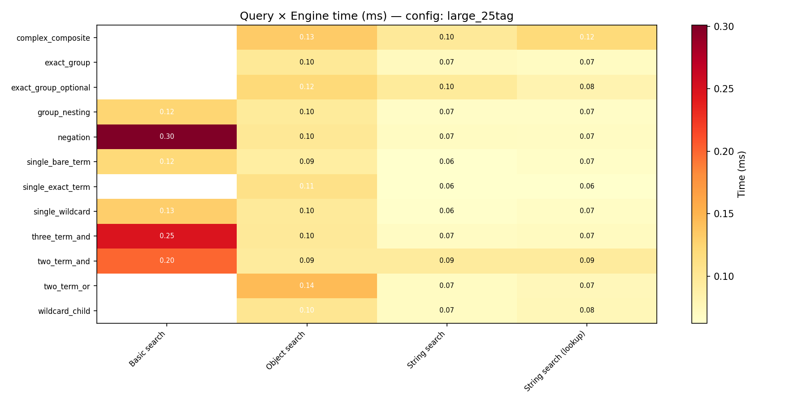

### Operation coverage and cost

Per-operation timing on a fixed structured string using all 18 operations from the query suite above. Basic search is slower than the tree-based engines on a single string — its speed advantage only appears for large batches, where vectorized pandas regex amortises the per-call overhead across many rows (see [Row-by-row search scaling](#row-by-row-search-scaling)). Basic search returns no results (not an error) for unsupported constructs, so queries using those operations will silently produce incorrect results.

(Example string: `Sensory-event, Action, Agent, (Event, (Onset, (Def/MyDef))), (Offset, Item, (Def-expand/MyDef, (Red, Blue))), (Visual-presentation, Square, Green)`)

| Operation                      | Object search (ms) | String search (ms) | Basic search  |
| ------------------------------ | -----------------: | -----------------: | ------------- |
| `bare_term`                    |              0.061 |              0.037 | 0.278 ms      |
| `and_2`                        |              0.063 |              0.041 | 0.321 ms      |
| `and_3`                        |              0.067 |              0.045 | 0.355 ms      |
| `negation`                     |              0.083 |              0.043 | 0.160 ms      |
| `wildcard_prefix` (`*` suffix) |              0.046 |              0.037 | 0.204 ms      |
| `nested_group_[]`              |              0.057 |              0.039 | 0.634 ms      |
| `deep_and_chain`               |              0.117 |              0.059 | 0.515 ms      |
| `or`                           |              0.058 |              0.037 | — unsupported |
| `exact_group_{}`               |              0.052 |              0.030 | — unsupported |
| `exact_optional_{:}`           |              0.071 |              0.043 | — unsupported |
| `exact_quoted`                 |              0.062 |              0.030 | — unsupported |
| `wildcard_?`                   |              0.086 |              0.047 | — unsupported |
| `wildcard_??`                  |              0.068 |              0.041 | — unsupported |
| `wildcard_???`                 |              0.074 |              0.041 | — unsupported |
| `descendant_nested`            |              0.138 |              0.086 | — unsupported |
| `double_negation`              |              0.057 |              0.035 | — unsupported |
| `complex_onset_def`            |              0.113 |              0.068 | — unsupported |
| `nested_or_and`                |              0.080 |              0.057 | — unsupported |

String search supports all 18 operation types.

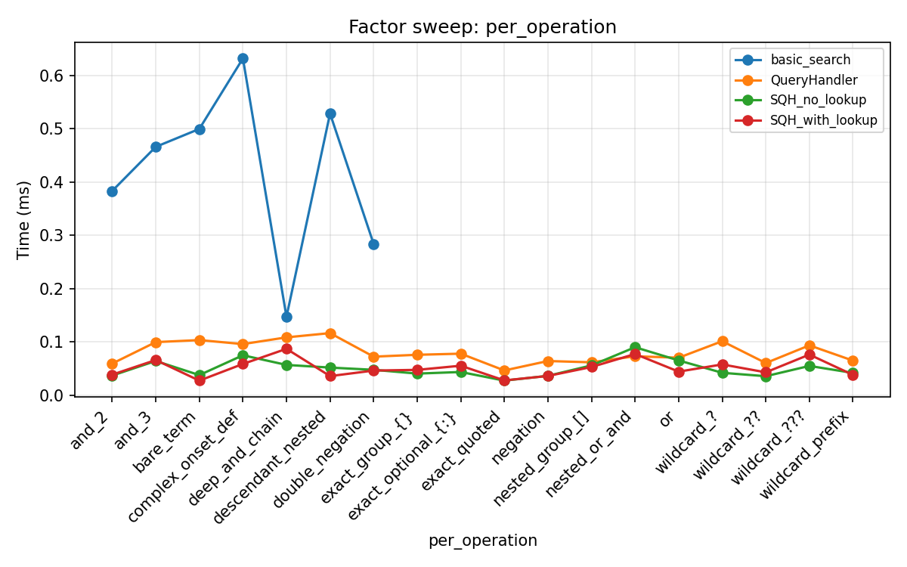

### Nesting depth

Parenthesisation depth from 0 (flat) to 20. Deeper nesting increases the tree walk for Object search and String search. Basic search shows no consistent depth trend because its cost depends on delimiter count, not recursion depth.

(Example string at depth 3, query `Event`: `Event, Action, (Cough, River, ((Catamenial, Background-subtask, ((Eyelid, Comatose, (Flex, Move-body))))))`)

| Depth | Object search (ms) | String search (ms) | Basic search (ms) |
| ----: | -----------------: | -----------------: | ----------------: |
|     0 |              0.026 |              0.017 |             0.125 |
|     1 |              0.022 |              0.013 |             0.256 |
|     2 |              0.028 |              0.019 |             0.218 |
|     3 |              0.034 |              0.023 |             0.215 |
|     5 |              0.110 |              0.076 |             0.531 |
|    10 |              0.094 |              0.060 |             0.385 |
|    15 |              0.116 |              0.082 |             0.226 |
|    20 |              0.409 |              0.140 |             0.200 |

At depth 20, object search is ~8× slower than at depth 0; string search is ~8× slower.

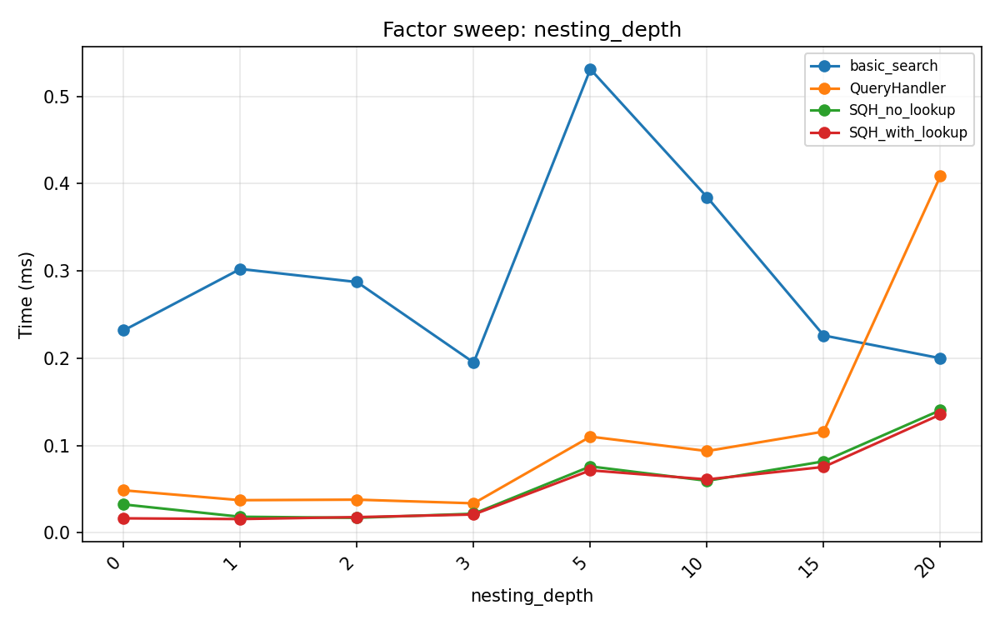

#### Deep nesting by query type

The nesting cost depends on query type. For group-structural queries (`group_match`, `two_term_and`) the engines must evaluate all candidate groups at each level, and object search shows a pronounced cost spike at depth 10 while string search stays flatter. All values in ms at depths 1–20.

(Example string at depth 5: `Event, Action, (Drop, Jealous, ((Drowsy, Angle, ((Sound-envelope, Pause, ((Headphones, Khaki, ((Adjacent-to, Age, (Ride, Measurement-device))))))))))`)

**Bare term:**

| Depth | Object search | String search | Basic search |
| ----: | ------------: | ------------: | -----------: |
|     1 |         0.030 |         0.019 |        0.204 |
|     5 |         0.045 |         0.031 |        0.198 |
|    10 |         0.087 |         0.059 |        0.209 |
|    20 |         0.141 |         0.154 |        0.212 |

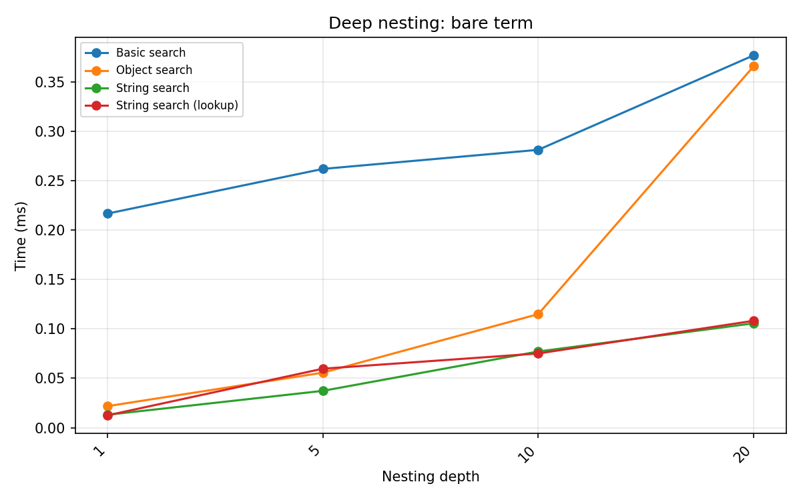

**Exact group `{}`:**

| Depth | Object search | String search |
| ----: | ------------: | ------------: |
|     1 |         0.025 |         0.018 |
|     5 |         0.053 |         0.036 |
|    10 |         0.105 |         0.072 |
|    20 |         0.209 |         0.146 |

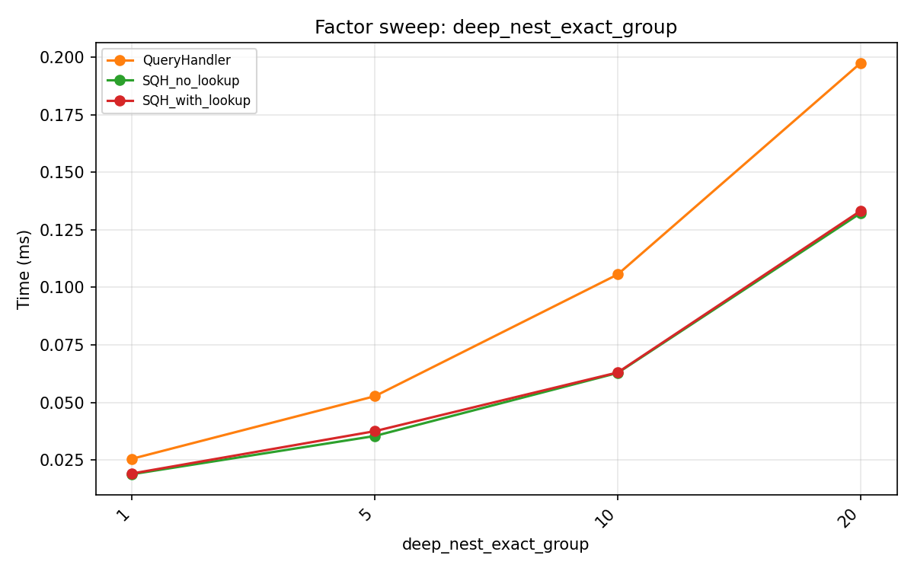

**Group match `[]`:**

| Depth | Object search | String search | Basic search |
| ----: | ------------: | ------------: | -----------: |
|     1 |         0.032 |         0.020 |        0.520 |
|     5 |         0.054 |         0.038 |        0.551 |
|    10 |         0.181 |         0.063 |        0.536 |
|    20 |         0.324 |         0.118 |        0.658 |

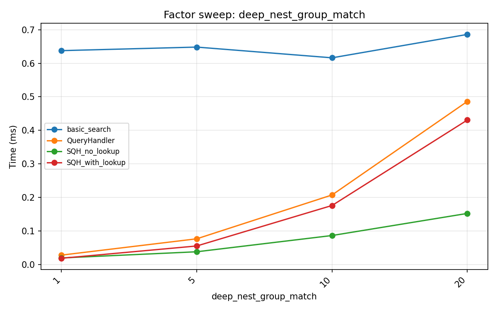

Object search at depth 10 is 5.7× its depth-1 cost; string search is only 3.2×.

**Negation:**

| Depth | Object search | String search | Basic search |
| ----: | ------------: | ------------: | -----------: |
|     1 |         0.021 |         0.014 |        0.128 |
|     5 |         0.055 |         0.037 |        0.163 |
|    10 |         0.101 |         0.072 |        0.121 |
|    20 |         0.177 |         0.129 |        0.112 |

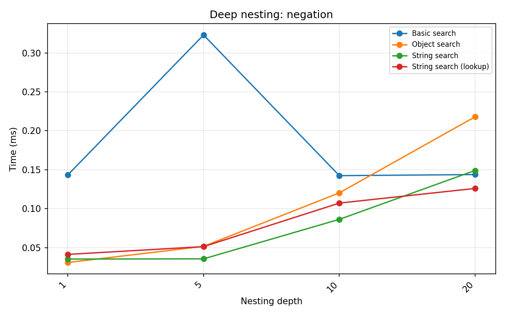

**Two-term AND:**

| Depth | Object search | String search | Basic search |
| ----: | ------------: | ------------: | -----------: |
|     1 |         0.043 |         0.024 |        0.422 |
|     5 |         0.065 |         0.052 |        0.395 |
|    10 |         0.205 |         0.070 |        0.274 |
|    20 |         0.320 |         0.109 |        0.355 |

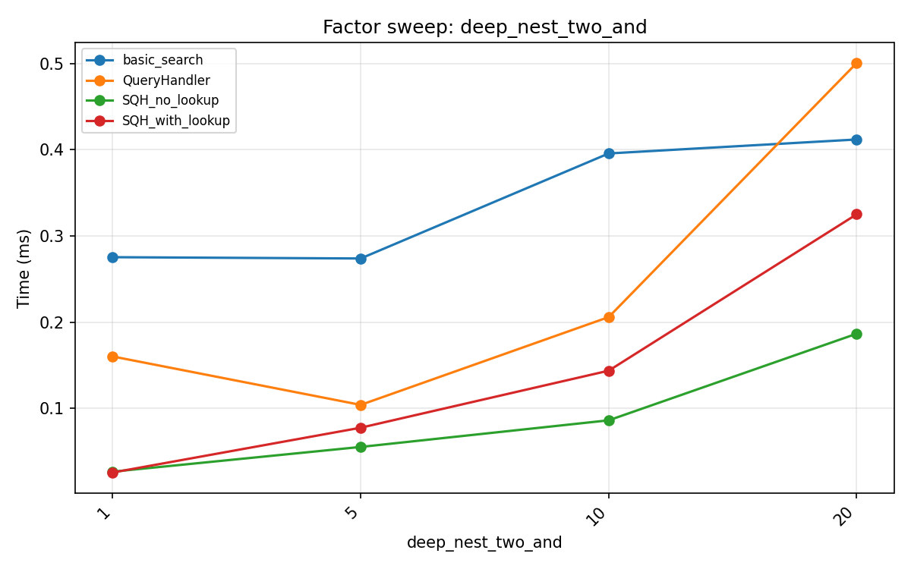

### Repeated tags

Repeating a target tag N times in the string. Basic search's `verify_search_delimiters` uses `itertools.product` over delimiter positions; repeated instances multiply the internal search space. Tree-based engines are linear in the number of candidates and are not affected.

(Example with 3 repeats of `Event`, query `(Event, Action)`: `Event, Green-color, Event, Action, Event, To-right-of, (Locked-in, Event)`)

| Occurrences | Object search (ms) | String search (ms) | Basic search (ms) |
| ----------: | -----------------: | -----------------: | ----------------: |
|           0 |              0.034 |              0.022 |             0.544 |
|           5 |              0.151 |              0.084 |             0.791 |
|          10 |              0.093 |              0.073 |             0.940 |
|          20 |              0.182 |              0.138 |             0.668 |
|          40 |              0.200 |              0.195 |             0.654 |

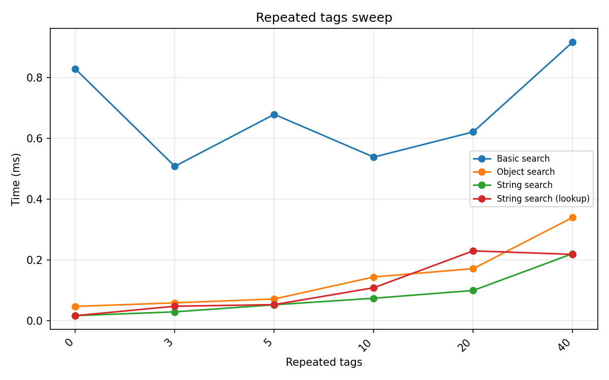

### Compile vs. search

Query compilation is a one-time cost; subsequent searches against different strings reuse the compiled expression. Reusing a compiled handler across many strings amortises compilation cost to near zero.

(Example string, query `Event`: `Statistical-uncertainty, Categorical-value, Tablet-computer, Agent-cognitive-state, Data-median, Little-toe, Eye, Sound-envelope-attack, Nose, (Description, Discrete), (Electrode-movement-artifact, Burp), (Snow, Between)`)

| Phase   | Object search (ms) | String search (ms) |
| ------- | -----------------: | -----------------: |
| Compile |              0.004 |              0.005 |
| Search  |              0.053 |              0.036 |

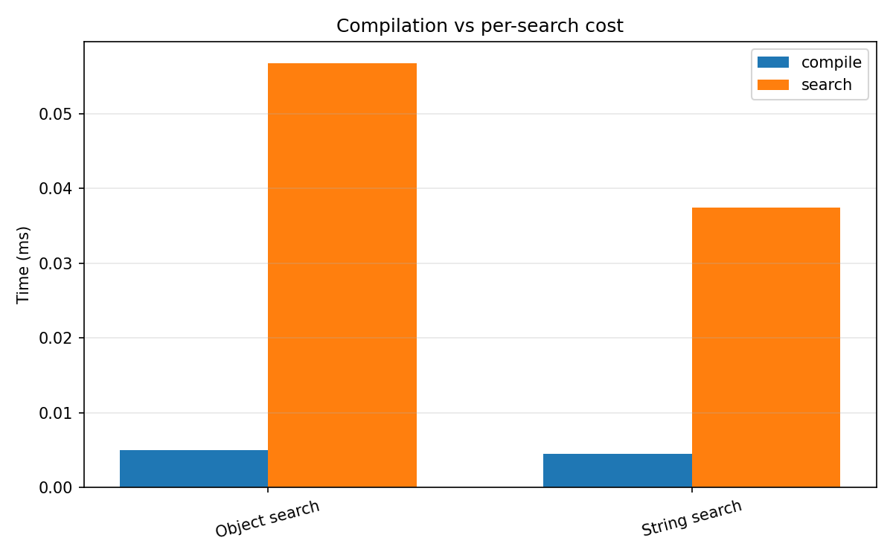

### Real BIDS data

Search over 200 rows of the `eeg_ds003645s_hed` BIDS test dataset.

(Example row: `Sensory-event, Experimental-stimulus, (Def/Face-image, Onset), (Def/Blink-inhibition-task, Onset), (Def/Fixation-task, Onset), Def/Unfamiliar-face-cond, Def/First-show-cond, (Image, Pathname/u032.bmp)`)

| Query                  | Object search (ms) | Basic search (ms) | String search (ms) |
| ---------------------- | -----------------: | ----------------: | -----------------: |
| `single_bare_term`     |                9.0 |               2.5 |                6.5 |
| `single_wildcard`      |                8.2 |               0.6 |                4.9 |
| `negation`             |                8.0 |               0.9 |                6.8 |
| `two_term_and`         |                8.8 |               1.2 |                4.9 |
| `three_term_and`       |                8.5 |               1.9 |                5.1 |
| `group_nesting`        |                7.9 |               0.3 |                7.8 |
| `two_term_or`          |                7.9 |                 — |                6.8 |
| `exact_group`          |                9.3 |                 — |                6.6 |
| `exact_group_optional` |               11.7 |                 — |                5.8 |
| `single_exact_term`    |                8.1 |                 — |                5.5 |
| `wildcard_child`       |               12.6 |                 — |                8.9 |
| `complex_composite`    |               14.2 |                 — |                9.5 |

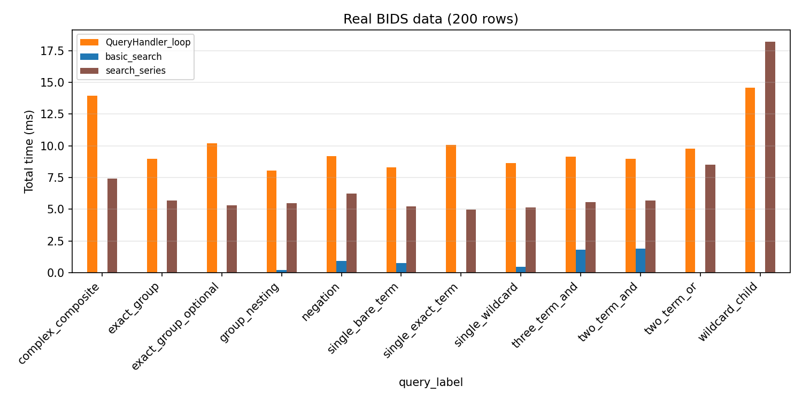

### Tag count

Number of tags in the HED string (1 to 100), query `Event`. Basic search time is dominated by regex compilation overhead and stays roughly constant; tree-based engines scale linearly with the number of nodes to traverse.

(Example 10-tag string: `Human-agent, Move, Computed-feature, Age, Aroused, 3D-shape, Little-toe, To-right-of, Brain-region, DarkSeaGreen`)

| Tags | Object search (ms) | String search (ms) | Basic search (ms) |
| ---: | -----------------: | -----------------: | ----------------: |
|    1 |              0.014 |              0.004 |             0.294 |
|    5 |              0.019 |              0.013 |             0.163 |
|   10 |              0.031 |              0.018 |             0.150 |
|   25 |              0.061 |              0.080 |             0.124 |
|   50 |              0.149 |              0.160 |             0.184 |
|  100 |              0.287 |              0.167 |             0.271 |

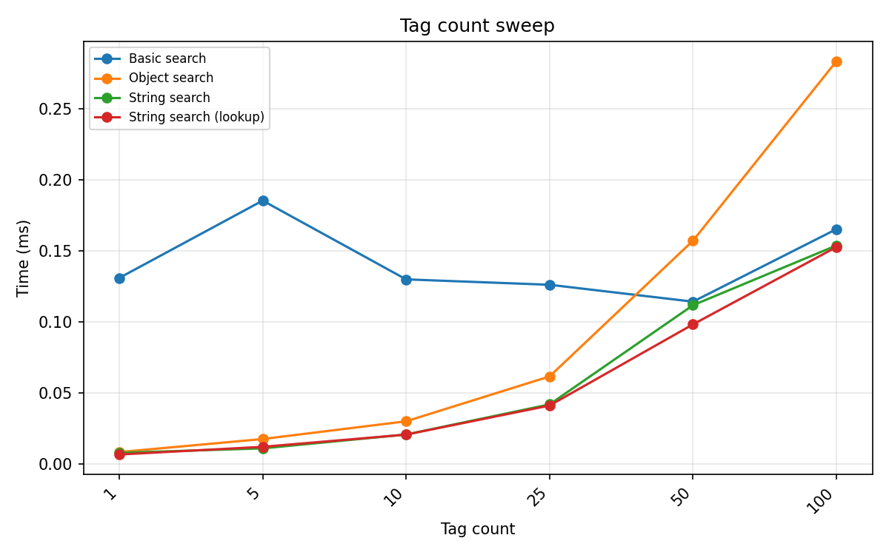

The tree-based crossover with basic search occurs around 25–50 tags, where traversal cost meets the regex setup cost.

### String form

Short-form vs long-form HED strings, query `Event`. Long-form strings use fully expanded paths (e.g. `Event/Sensory-event`), increasing string length and parse cost. Basic search is largely unaffected because it matches on short tag names via word-boundary patterns.

(Example short-form string: `Yawn, Frustrated, Famous, Plan, Catamenial, Instep, Sound-envelope-attack, Categorical-value, Azure, (Species-identifier, Auditory-device), (Collection, Muddy-terrain), (Alarm-sound, Data-marker)`)

| Form  | Object search (ms) | String search (ms) | Basic search (ms) |
| ----- | -----------------: | -----------------: | ----------------: |
| short |              0.044 |              0.029 |             0.124 |
| long  |              0.074 |              0.063 |             0.121 |

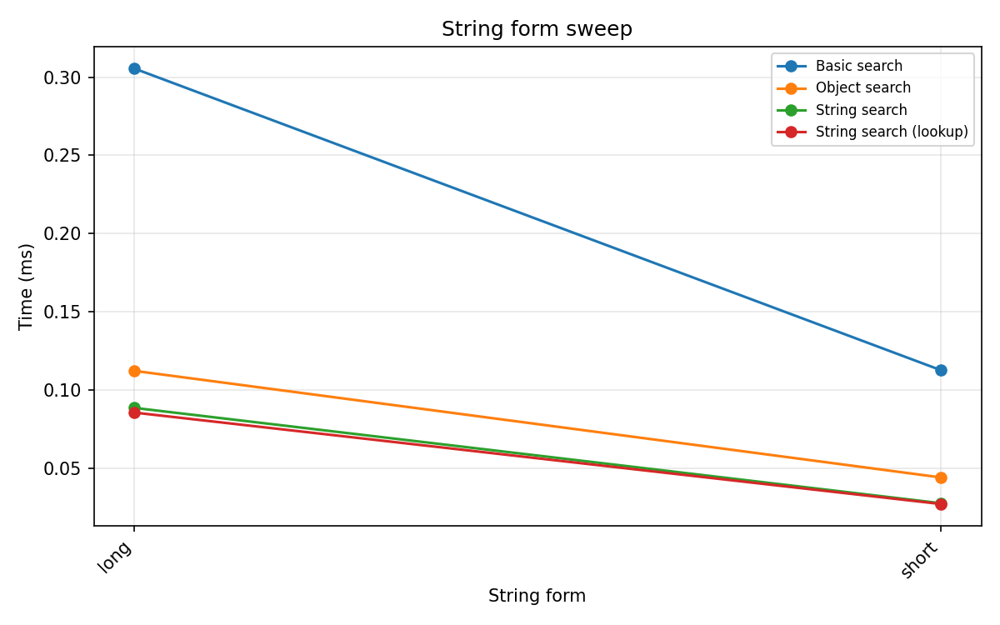

Object search is 1.7× slower on long-form strings; string search is 2.2× slower.

### Schema lookup overhead

The `schema_lookup` dictionary (produced by `generate_schema_lookup(schema)`) determines whether string search resolves parent-class queries. Without it, a bare term matches only the exact tag name literally present in the string. With it, every tag carries its full ancestor path from the schema, so a query like `Event` correctly matches any descendant such as `Sensory-event` or `Agent-action`.

The table below uses a fixed short-form string that contains known Event and Action descendants (`Sensory-event, Agent-action, Data-feature, Communicate, Clap-hands, …`) to make the correctness difference explicit.

| Query                     | No lookup: time (ms) | No lookup: matches | With lookup: time (ms) | With lookup: matches |
| ------------------------- | -------------------: | -----------------: | ---------------------: | -------------------: |
| Ancestor: Event           |                0.031 |                  0 |                  0.031 |                    5 |
| Ancestor: Action          |                0.029 |                  0 |                  0.033 |                    7 |
| Exact: Sensory-event      |                0.028 |                  1 |                  0.052 |                    1 |
| Compound: Event && Action |                0.022 |                  0 |                  0.087 |                   20 |

Key observations:

- **Ancestor queries without lookup silently return zero matches.** This is a correctness issue, not a performance trade-off — if you search for `Event` on short-form strings without a lookup table, you will miss every row containing only descendants like `Sensory-event`.
- **Exact queries work without lookup** and are slightly faster because no ancestor-tuple construction occurs.
- **With lookup, compound ancestor queries are noticeably slower** (0.087 ms vs 0.022 ms here) because the engine produces many more match results when hierarchical expansion is active.
- **Long-form strings** (`Event/Sensory-event`) do not need a lookup table — the slash path already encodes the ancestor chain. Use `string_form="long"` or convert first with `convert_to_form()` if you want ancestor matching without the lookup overhead.

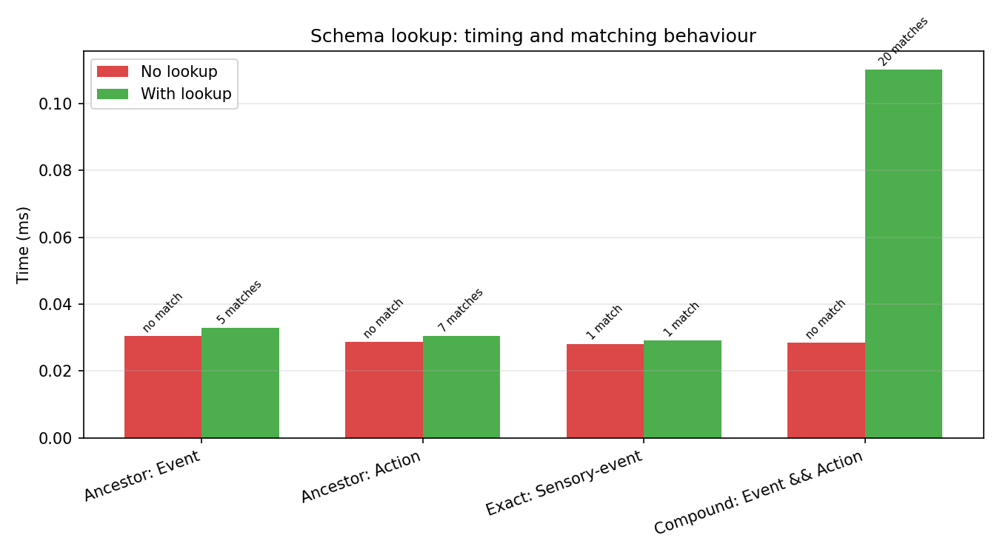

### Group count and query complexity

More top-level parenthesised groups increase the number of children the tree must inspect. Query complexity (more AND/OR clauses) adds expression-tree nodes to evaluate per candidate.

**Group count** (0–20 single-level groups, query `Event`. Example at 5 groups: `Statistical-uncertainty, Categorical-value, Tablet-computer, (Agent-cognitive-state, Data-median), (Little-toe, Eye), (Sound-envelope-attack, Nose), (Description, Discrete), (Electrode-movement-artifact, Burp)`):

| Groups | Object search (ms) | String search (ms) | Basic search (ms) |
| -----: | -----------------: | -----------------: | ----------------: |
|      0 |              0.032 |              0.022 |             0.139 |
|      1 |              0.028 |              0.019 |             0.129 |
|      5 |              0.045 |              0.030 |             0.114 |
|     10 |              0.080 |              0.053 |             0.135 |
|     20 |              0.140 |              0.085 |             0.136 |

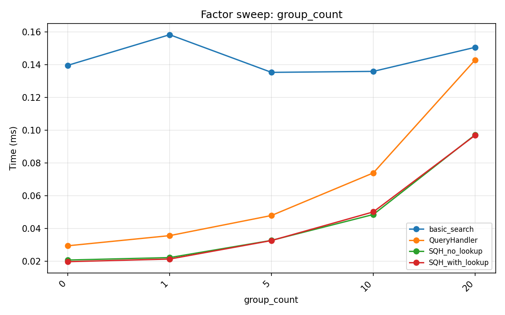

**Query complexity** (1-clause bare term → 8-clause composite. Example string: `Human-agent, Move, Computed-feature, Age, Aroused, 3D-shape, Little-toe, To-right-of, Brain-region, DarkSeaGreen, (FireBrick, (Flex, Move-body)), (Categorical-value, (Eyelid, Comatose)), (Robotic-agent, (Catamenial, Background-subtask)), (Keyboard, (Cough, River)), (ForestGreen, (Green-color, Locked-in))`):

| Complexity            | Object search (ms) | String search (ms) | Basic search |
| --------------------- | -----------------: | -----------------: | ------------ |
| 1 — single term       |              0.134 |              0.100 | 0.247 ms     |
| 2 — two AND           |              0.152 |              0.093 | 0.405 ms     |
| 3 — three AND         |              0.158 |              0.103 | 0.460 ms     |
| 4 — OR                |              0.134 |              0.071 | —            |
| 5 — negation          |              0.088 |              0.056 | 0.286 ms     |
| 6 — group `[]`        |              0.138 |              0.094 | 0.361 ms     |
| 7 — exact group `{}`  |              0.120 |              0.078 | —            |
| 8 — complex composite |              0.106 |              0.078 | —            |

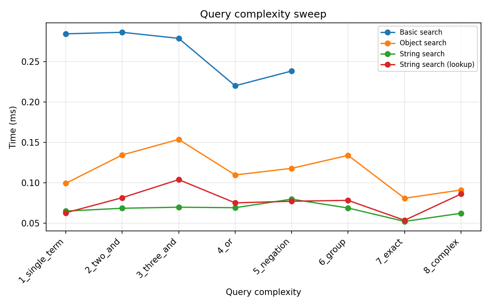

### Choosing an implementation

**Use basic search** when you need the fastest possible batch filter, your queries can be expressed with simple terms, AND, negation, or descendant wildcards (`*`), and schema-aware ancestor matching is not required. Ideal for quick event file filtering when query simplicity is acceptable.

**Use string search** (via `string_search()`) when you need the full query language (OR, exact groups, logical groups, `?`/`??`/`???` wildcards) and are working with raw strings from tabular files or sidecars. This is the best general-purpose choice — it is ~39% faster than an object search loop per string and close to basic search on large strings.

**Use object search** when you already have parsed `HedString` objects (for example from a validation pipeline), or when you need results as structured `HedString`/`HedTag` objects rather than boolean matches. The additional overhead relative to string search comes from `HedString` construction, not from search expression evaluation, so reusing pre-parsed objects avoids the cost entirely.

### Benchmark methodology

- **Timing:** `timeit` — 20 iterations (single-string), 5 iterations (list search), 10 iterations (sweeps). Median reported.
- **Schema:** HED 8.4.0, loaded once and reused.
- **Synthetic data:** Strings built from real schema tags with controlled tag count, nesting depth, group count, and tag repetition.
- **`schema_lookup`:** Generated via `generate_schema_lookup(schema)` — a dict mapping each short tag to its ancestor tuple, enabling ancestor-based matching in string search without a full schema load per string.
- **Hardware note:** Absolute timings depend on hardware; relative ratios between engines are the meaningful comparison.
