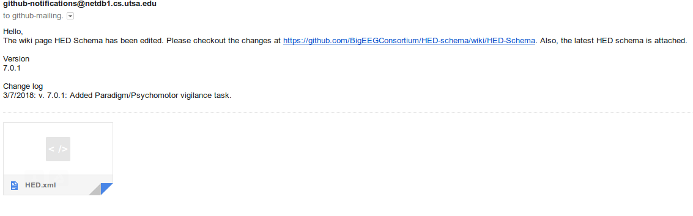

# hedemailer

hedemailer is a Python 3 package is a webhook implementation that sends out an email whenever there is an update to the Wiki HED schema. 

For the HED schema please visit: <https://github.com/hed-standard/hed-specification> or
[hedtags.org](http://hedtags.org) for an html schema viewer.

### Dependencies

* [Python 3](https://www.python.org/downloads/)
* SMTP server
* [hedconverter]

### Screenshots

### Notes
* The webhook has been implemented to ONLY accept JSON content type and Wiki page updates (gollum) events. 
* Emails may potentially be blocked without a fully-qualified domain name.  
